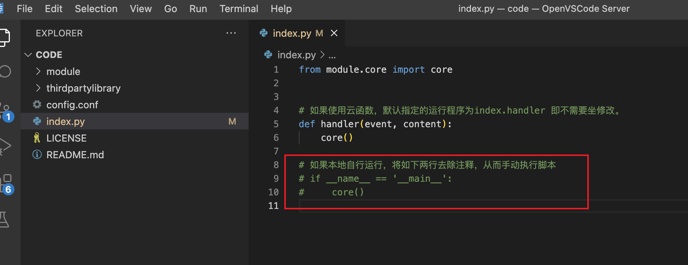

# T00lsSign

T00ls自动签到、查域名脚本(搭配云函数使用)

## 使用说明

**1.config.conf配置文件**

```
[login]
username = ""           # 用户名
password = ""           # 密码，md5 32位小写
question_num = ""       # 密保问题
question_answer = ""    # 密保答案
```

> 密保问题对应值如下
>
> ```
> # 0 = 没有安全提问
> # 1 = 母亲的名字
> # 2 = 爷爷的名字
> # 3 = 父亲出生的城市
> # 4 = 您其中一位老师的名字
> # 5 = 您个人计算机的型号
> # 6 = 您最喜欢的餐馆名称
> # 7 = 驾驶执照的最后四位数字
> ```

**2.打码平台信息修改**

* 如下使用的是anti-captcha识别 https://anti-captcha.com/ ，注册用户，可以用加密货币小额充值，填入获取到的clientKey，1000次识别2美刀。

```
[anti-captcha]
clientKey =
```

**3.推送设置**

* 推送目前设置了bark、dingding，如何配置自行查找方法。**默认关闭推送**，需要**开启推送**将 `pushServer` 修改为 `1` ，并且设置 `pushType` 为相应的推送方式（bark / dingding）。

```
# 推送设置
[push]
# 推送开关，0为关闭，1为开启，默认关闭
pushServer = 0
# 选择推送方式，目前支持：bark、dingding
pushType =
```

* bark推送

  bark推送需要设置服务地址以及在app上获取到的key值。

  ```
  # 1. bark推送方式填写如下内容
  [bark]
  # 示例：https://test.com
  bark_ServerUrl =
  # 从bark app上获取
  bark_Key =
  ```

* dingding推送

  钉钉推送需要创建群机器人，安全选项选“加签”，获取到key值填入下`dingkey`即可，获取到加签的secret添如到`secret`。

  ```
  # 2. dingding推送方式填写如下内容
  [dingding]
  # webhook access_token值
  dingding_AccessToken =
  # 安全选项选"加签"，secret值
  dingding_Secret =
  ```

## 云函数配置

**1.云函数配置**

* 使用的阿某云函数，注册好之后，搜索**函数计算 FC**—>服务与函数—>创建服务—>服务名随便写，日志记录最好是开启
* 进入服务后—>创建函数—>函数名自定义—>**运行环境选择python3.9**—>**执行方法处用默认** `index.handler` 即可。
* 可以选择通过文件夹上传代码，将修改好config.conf配置文件后整个文件夹拖入上传窗口。
* 高级配置中，将**超时时间设置为最长900s**。


**2.代码修改**

* 因为默认是使用的云函数，所以代码中注释掉了`if __name__ == '__main__'`及以下的代码。

* 如果不是使用的云函数，自行将如上注释的内容去掉注释直接执行即可。

**3.设置定时触发任务**

* 可自行设置触发时间，在触发器配置中，触发器类型选择：定时触发器。触发方式可以选择自定义
* CRON表达式：例如每天上午10点触发一次，cron表达式为：`0 0 10 * * * *`

